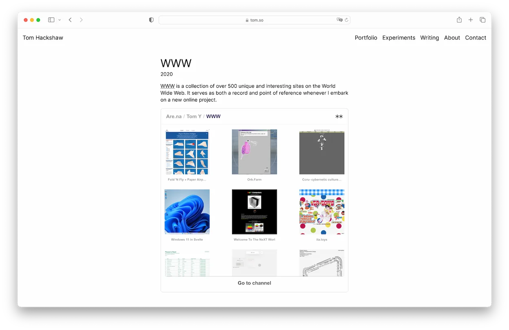

# Portfolio Redux

Built using [Eleventy](https://www.11ty.dev/), and forked from Sam Baldwin and Piper Haywood's [Portfolio Starter](https://portfolio-starter.sb-ph.com/) theme. All thanks and credits to them - all I have done is hack the project to my liking.

This is a great template to use for showcasing work. It is lightweight, simple to read and only requires knowledge of Markdown to post. It can be extended further with basic HTML and CSS to support different post styles and formatting where required.

Some changes I have made to this template include:
- adding a hamburger menu for mobile screen widths
- adding a blurred navigation bar to keep links legible when scrolling over content
- updated certain dependencies to ensure security
- added keyboard focus states for greater accessibility

### Building and deploying

Simply fork/clone this repo, then use `npx @11ty/eleventy --serve` in the directory to develop and edit content locally.

To deploy and host this site, I recommend [Vercel](https://vercel.com). [Netlify](https://netlify.com) and [Cloudflare Pages](https://pages.cloudflare.com/) are also a good choices. Your forked repo can be built and deployed from Vercel. It should now detect that it is Eleventy and do this automatically, but if it doesn't simply add the following before beginning the building process:

Build command: `npx @11ty/eleventy`
Output directory: `_site`

From the Vercel dashboard you can set things like redirects, custom domains, analytics, and so on.

Deploy using Vercel below

