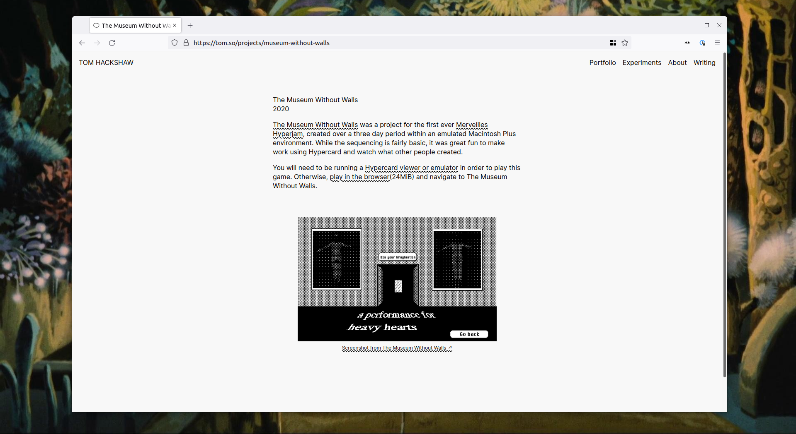

# Portfolio Redux

Built using [Eleventy](https://www.11ty.dev/), and forked from Sam Baldwin and Piper Haywood's [Portfolio Starter](https://portfolio-starter.sb-ph.com/) theme. All thanks and credits to them - all I have done is hack the theme to my liking.

This is a great template to use for showcasing work. It is lightweight, simple to read and only really requires knowledge of Markdown to post.

### Building and deploying

Simply fork/clone this repo, then use `npx @11ty/eleventy --serve` in the directory to develop and edit content locally.

To deploy and host this site, I recommend [Vercel](https://vercel.com) (formerly known as ZEIT). [Netlify](https://netlify.com) is also a good choice. Your forked repo can be built and deployed from Vercel. It should now detect that it is Eleventy and do this automatically, but if it doesn't simply add the following before beginning the building process:

Build command: `npx @11ty/eleventy`
Output directory: `_site`

From the Vercel dashboard you can set things like redirects, custom domains, and so on.

The source of my site is hosted both on GitHub and Sourcehut. Any future projects that I embark on will do the same, with the hope that eventually I can migrate all of my development onto Sourcehut.

Deploy using Vercel below

